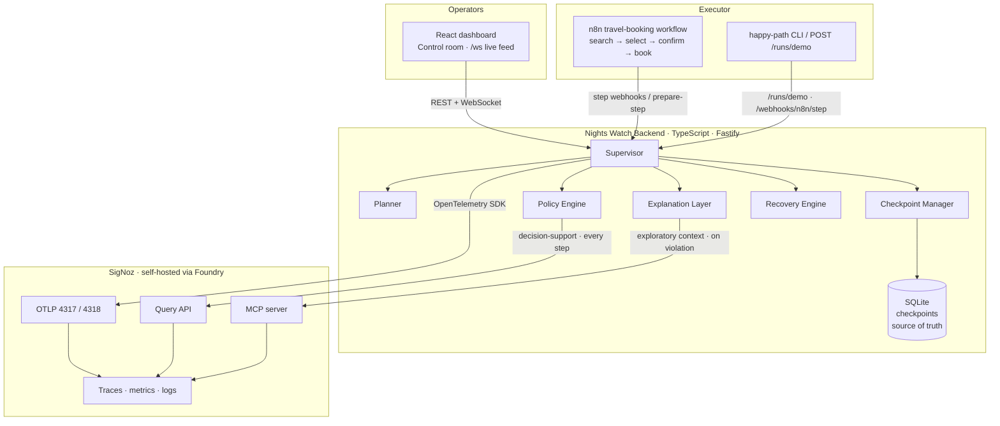
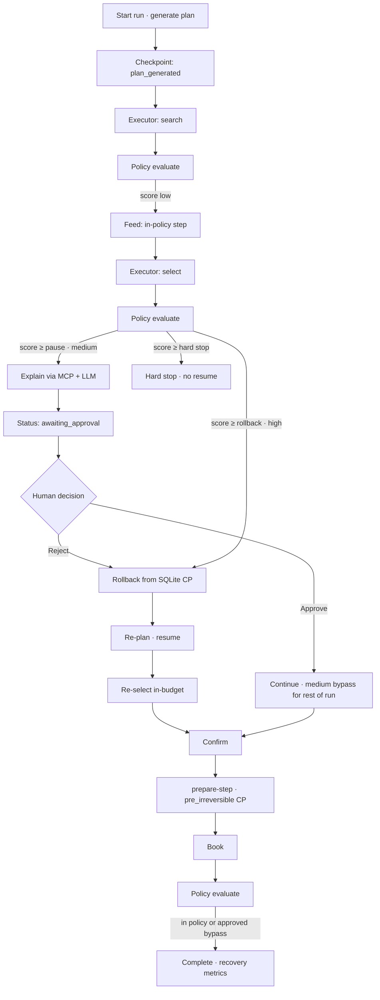

# Nights Watch

Runtime resilience for AI agents — **SigNoz as a control plane**, not a passive dashboard.

An n8n (or CLI) travel-booking agent executes a plan. A TypeScript **Supervisor** scores every step against that plan, explains violations in plain language, pauses for human approval on medium severity, rolls back to a local checkpoint before irreversible actions, re-plans, and resumes — without restarting from scratch.

Companion docs: [`PROJECT_OVERVIEW.md`](./PROJECT_OVERVIEW.md) · [`CURSOR_GUIDE.md`](./CURSOR_GUIDE.md) · [`CONTRIBUTING.md`](./CONTRIBUTING.md)

---

## Status

| Phase | Focus | Status |
|---|---|---|
| 0 | Scaffold + OTel → SigNoz | Done |
| 1 | Plan + Executor (n8n / happy-path harness) | Done |
| 2 | Checkpoint Manager (SQLite + `checkpoint.created`) | Done |
| 3 | Policy Engine (rules + Query API + score) | Done |
| 4 | Explanation Layer (MCP + LLM + `policy.explanation`) | Done |
| 5 | Recovery Engine (rollback → re-plan → resume) | Done |
| 6 | Live React dashboard (Art Deco control room) | Done |
| 7 | Human approval + pre-irreversible checkpoints | Done |
| 8 | Demo prep (README, casting, demo script, live link) | In progress |

---

## Architecture

SigNoz owns **observability**. The Supervisor owns **execution state**. Rollback never depends on a SigNoz query — only on the local SQLite checkpoint store. SigNoz still receives correlated spans for every checkpoint, policy evaluation, explanation, and recovery outcome.



### Access rules (do not blur)

| Consumer | SigNoz path | Why |
|---|---|---|
| Policy Engine | **Query API only** | On every step; needs fast, typed, deterministic answers |
| Explanation Layer | **MCP only** | Occasional; LLM decides what context to pull |
| Rollback / resume | **Local SQLite only** | Never reconstruct state from SigNoz spans |

---

## Control-loop workflow

End-to-end path for the travel-booking scenario (inject-drift demo highlighted).



**Severity → action**

| Severity | Trigger (default) | Action |
|---|---|---|
| Low | score &lt; pause (40) | Continue; narrate step on feed |
| Medium | pause ≤ score &lt; rollback (70) | Pause → human Approve / Reject |
| High | rollback ≤ score &lt; hard stop (90) | Auto rollback + re-plan |
| Hard stop | score ≥ 90 | Halt; no auto-resume |

---

## Repo layout

```
casting.yaml / casting.yaml.lock   Foundry casting (judge-reproducible SigNoz)
backend/                           Fastify + OTel + policy / checkpoints / recovery / explanation
dashboard/                         React + Vite + Tailwind control room
n8n-workflows/                     travel-booking Executor export
infra/signoz/                      WSL helpers (port expose, verify scripts)
docker-compose.yml                 Backend + dashboard (SigNoz separate via Foundry)
```

---

## Quick start

### 1. SigNoz (Foundry)

Judges can reproduce the SigNoz stack from the repo-root casting:

```bash
curl -fsSL https://signoz.io/foundry.sh | bash
foundryctl cast -f casting.yaml
# UI typically http://localhost:8080 · OTLP http://localhost:4318 · MCP :8000
```

`casting.yaml` enables the **SigNoz MCP server** (required for the Explanation Layer). `casting.yaml.lock` pins the forged resolution.

### 2. App env

```bash
cp .env.example .env
# OTEL_EXPORTER_OTLP_ENDPOINT=http://localhost:4318
# SIGNOZ_QUERY_API_URL=http://localhost:8080
# SIGNOZ_MCP_ENDPOINT=http://localhost:8000
# Optional: ANTHROPIC_API_KEY / OPENAI_API_KEY for richer plans & explanations
```

### 3. Backend + dashboard

```bash
# Option A — Docker (app only)
docker compose up --build
# API  http://localhost:3001/health
# UI   http://localhost:5173   (/api and /ws proxied)

# Option B — local dev
cd backend && npm install && npm run dev
cd dashboard && npm install && npm run dev
```

### 4. Run the demo harness

```bash
cd backend
npm run happy-path          # clean booking under $400
npm run happy-path:drift    # $1200 bait → pause → CLI auto-reject → rollback → resume → book
```

On the dashboard: **Start run (inject drift)** → **Reject & recover** when the approval panel appears. Watch Policy Score, explanation feed, and Recovery Health update live.

### Verify in SigNoz UI

1. Traces → filter `service.name = nights-watch` and `run.id = <id>`
2. Open the `run.execute` waterfall: `executor.step`, `checkpoint.created` (including `pre_irreversible`), `policy.evaluation`, `policy.explanation`, `human.decision`, `checkpoint.restored`, `recovery.outcome`
3. CLI: `npm run spans:verify -- <runId>` · local CPs: `npm run checkpoints:list -- <runId>`

---

## Demo path (judges)

1. `foundryctl cast -f casting.yaml` (or use an already-running SigNoz matching the casting).
2. `docker compose up --build` (or local `npm run dev` for backend + dashboard).
3. Open the control room → **Start run (inject drift)** → **Reject & recover**.
4. Show SigNoz trace for the same `run.id` (score spike, explanation, pre-irreversible CP before book, recovery).
5. Optional: `npm run happy-path:drift` for an unattended CLI path (auto-rejects medium pause).

---

## Future scope

### Dynamic budget tracking

**What shipped today:** the plan carries a hard `maxBudget` (e.g. $400). The Policy Engine already fires a **budget-breach** rule when a step’s `costUsd` exceeds that ceiling, which drives Policy Score and can pause / roll back / hard-stop. The dashboard shows max budget and cumulative `budgetConsumed` on the run summary. That is **policy-over-price**, not a continuous spend gauge with an independent kill switch.

**What dynamic budget would add (not built):**

1. **Live cost / token gauge** on the control room — a first-class panel that charts spend (and optionally LLM token cost) against the approved ceiling as the run progresses, not only when a rule fires.
2. **Budget-ceiling hard-stop independent of Policy Score** — today a hard stop only fires when the composite Policy Score crosses the hard-stop threshold. Dynamic budgeting would halt the Executor when `budgetConsumed >= ceiling` even if other rules keep the score below that line (e.g. many small in-tool drifts that never individually look “high severity”).
3. **Separate telemetry** — emit dedicated OTel metrics (e.g. `budget.consumed`, `budget.remaining_ratio`) so SigNoz dashboards and alert rules can page on spend alone, without conflating cost with tool-mismatch or step-order weights.
4. **Planner / re-plan awareness** — feed remaining budget into re-plan prompts so recovery prefers cheaper paths after a near-ceiling run, rather than only reacting after the next over-budget select/book.

**Why it was deferred:** Phase 7 prioritized human approval and pre-irreversible checkpoints (higher demo leverage). Budget is already partially enforced via policy rules; a full gauge + independent hard-stop is the natural next control-plane loop once the demo path is stable.

**Out of scope (still cut):** multi-scenario agents, ML-based scoring, generic multi-framework SDK, production auth / multi-tenant persistence.

---

## CI

GitHub Actions on push/PR to `main`:

- Backend `npm run typecheck`
- Dashboard `npm run typecheck` + `npm run build`
- Sanity check that `.env` is not tracked

---

## References

Documentation and specs this project was built against:

### SigNoz & Foundry

- [SigNoz documentation](https://signoz.io/docs/) — platform overview, self-host, instrumentation
- [Introducing SigNoz Foundry](https://signoz.io/blog/introducing-signoz-foundry/) — one-config deployment model
- [SigNoz/foundry](https://github.com/SigNoz/foundry) — `foundryctl` CLI, casting / moldings / pours
- [Foundry casting concept](https://github.com/SigNoz/foundry/blob/main/docs/concepts/casting.md) — `casting.yaml` structure
- [Foundry CLI reference](https://github.com/SigNoz/foundry/blob/main/docs/reference/cli.md) — `gauge` / `forge` / `cast`
- This repo’s judge-facing casting: [`casting.yaml`](./casting.yaml) · [`casting.yaml.lock`](./casting.yaml.lock)

### SigNoz MCP & Query API

- [SigNoz MCP server](https://signoz.io/docs/llm/mcp/) — MCP used by the Explanation Layer only
- SigNoz Query API (HTTP) — used by the Policy Engine for prior-score / decision-support context on every step

### OpenTelemetry

- [OpenTelemetry](https://opentelemetry.io/docs/) — traces, metrics, semantic conventions
- [OTel JS / Node SDK](https://opentelemetry.io/docs/languages/js/) — backend instrumentation (`checkpoint.created`, `policy.evaluation`, `policy.explanation`, recovery metrics)

### Executor & app stack

- [n8n documentation](https://docs.n8n.io/) — Executor workflow (`n8n-workflows/travel-booking.json`)
- [Fastify](https://fastify.dev/) — backend HTTP + WebSocket attachment
- [React](https://react.dev/) · [Vite](https://vitejs.dev/) · [Tailwind CSS](https://tailwindcss.com/) — dashboard

### Project specs (in-repo)

- [`PROJECT_OVERVIEW.md`](./PROJECT_OVERVIEW.md) — idea, architecture rules, scope lock, demo script outline
- [`CURSOR_GUIDE.md`](./CURSOR_GUIDE.md) — phase checklist and non-negotiable implementation rules
- [`CONTRIBUTING.md`](./CONTRIBUTING.md) — local workflow and PR expectations

---

## License

MIT — see [`LICENSE`](./LICENSE).
