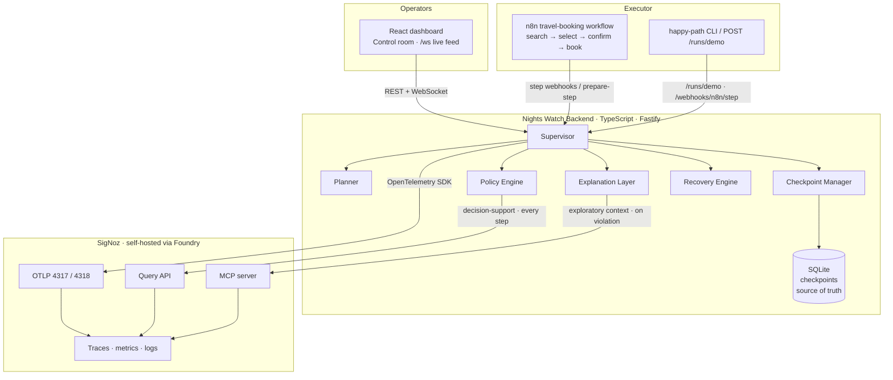
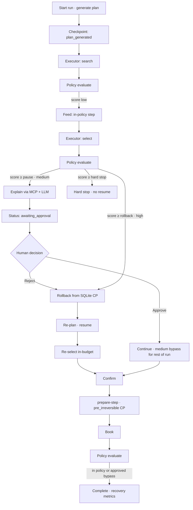
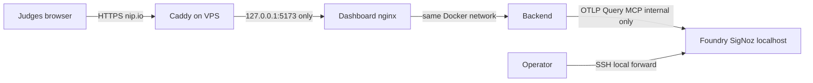

# Nights Watch

Runtime resilience for AI agents — **SigNoz as a control plane**, not a passive dashboard.

An n8n (or CLI) travel-booking agent executes a plan. A TypeScript **Supervisor** scores every step against that plan, explains violations in plain language, pauses for human approval on medium severity, rolls back to a local checkpoint before irreversible actions, re-plans, and resumes — without restarting from scratch.

Companion docs: [`PROJECT_OVERVIEW.md`](./PROJECT_OVERVIEW.md) · [`CURSOR_GUIDE.md`](./CURSOR_GUIDE.md) · [`CONTRIBUTING.md`](./CONTRIBUTING.md)

---

## Status

| Phase | Focus | Status |
|---|---|---|
| 0 | Scaffold + OTel → SigNoz | Done |
| 1 | Plan + Executor (n8n / happy-path harness) | Done |
| 2 | Checkpoint Manager (SQLite + `checkpoint.created`) | Done |
| 3 | Policy Engine (rules + Query API + score) | Done |
| 4 | Explanation Layer (MCP + LLM + `policy.explanation`) | Done |
| 5 | Recovery Engine (rollback → re-plan → resume) | Done |
| 6 | Live React dashboard (Art Deco control room) | Done |
| 7 | Human approval + pre-irreversible checkpoints | Done |
| 8 | Demo prep (README, casting, demo script, always-on live link) | Docs ready · live URL pending |

---

## Architecture

SigNoz owns **observability**. The Supervisor owns **execution state**. Rollback never depends on a SigNoz query — only on the local SQLite checkpoint store. SigNoz still receives correlated spans for every checkpoint, policy evaluation, explanation, and recovery outcome.



### Access rules (do not blur)

| Consumer | SigNoz path | Why |
|---|---|---|
| Policy Engine | **Query API only** | On every step; needs fast, typed, deterministic answers |
| Explanation Layer | **MCP only** | Occasional; LLM decides what context to pull |
| Rollback / resume | **Local SQLite only** | Never reconstruct state from SigNoz spans |

---

## Control-loop workflow

End-to-end path for the travel-booking scenario (inject-drift demo highlighted).



**Severity → action**

| Severity | Trigger (default) | Action |
|---|---|---|
| Low | score &lt; pause (40) | Continue; narrate step on feed |
| Medium | pause ≤ score &lt; rollback (70) | Pause → human Approve / Reject |
| High | rollback ≤ score &lt; hard stop (90) | Auto rollback + re-plan |
| Hard stop | score ≥ 90 | Halt; no auto-resume |

---

## Repo layout

```
casting.yaml / casting.yaml.lock   Foundry casting (judge-reproducible SigNoz)
backend/                           Fastify + OTel + policy / checkpoints / recovery / explanation
dashboard/                         React + Vite + Tailwind control room
n8n-workflows/                     travel-booking Executor export
infra/signoz/                      WSL helpers (port expose, verify scripts)
docker-compose.yml                 Backend + dashboard (SigNoz separate via Foundry)
docker-compose.vps.yml             Loopback-only port bind for always-on VPS
scripts/verify-vps-deploy.sh       Post-deploy checks on the VPS
```

---

## Quick start

### 1. SigNoz (Foundry)

Judges can reproduce the SigNoz stack from the repo-root casting:

```bash
curl -fsSL https://signoz.io/foundry.sh | bash
foundryctl cast -f casting.yaml
# UI typically http://localhost:8080 · OTLP http://localhost:4318 · MCP :8000
```

`casting.yaml` enables the **SigNoz MCP server** (required for the Explanation Layer). `casting.yaml.lock` pins the forged resolution.

### 2. App env

```bash
cp .env.example .env
# OTEL_EXPORTER_OTLP_ENDPOINT=http://localhost:4318
# SIGNOZ_QUERY_API_URL=http://localhost:8080
# SIGNOZ_MCP_ENDPOINT=http://localhost:8000
# Optional: ANTHROPIC_API_KEY / OPENAI_API_KEY for richer plans & explanations
```

### 3. Backend + dashboard

```bash
# Option A — Docker (app only)
docker compose up --build
# API  http://localhost:3001/health
# UI   http://localhost:5173   (/api and /ws proxied)

# Option B — local dev
cd backend && npm install && npm run dev
cd dashboard && npm install && npm run dev
```

### 4. Run the demo harness

```bash
cd backend
npm run happy-path          # clean booking under $400
npm run happy-path:drift    # $1200 bait → pause → CLI auto-reject → rollback → resume → book
```

On the dashboard: **Start run (inject drift)** → **Reject & recover** when the approval panel appears. Watch Policy Score, explanation feed, and Recovery Health update live.

### Verify in SigNoz UI

1. Traces → filter `service.name = nights-watch` and `run.id = <id>`
2. Open the `run.execute` waterfall: `executor.step`, `checkpoint.created` (including `pre_irreversible`), `policy.evaluation`, `policy.explanation`, `human.decision`, `checkpoint.restored`, `recovery.outcome`
3. CLI: `npm run spans:verify -- <runId>` · local CPs: `npm run checkpoints:list -- <runId>`

---

## Demo path (judges)

1. Open the **live control room** (URL below) — or locally: `foundryctl cast -f casting.yaml` then `docker compose up --build`.
2. **Start run (inject drift)** → **Reject & recover**.
3. Show SigNoz trace for the same `run.id` (score spike, explanation, pre-irreversible CP before book, recovery). On the VPS, SigNoz is **not** public — use the recorded demo video or an SSH tunnel (see Live deployment).
4. Optional: `npm run happy-path:drift` for an unattended CLI path (auto-rejects medium pause).

Timed walkthrough: [`demoscript.md`](./demoscript.md).

---

## Live deployment (always-on judge link)

Judges need a URL that stays up when your laptop is off. **Do not** use a laptop Cloudflare/ngrok quick tunnel as the submission link.

**Free default:** [Oracle Cloud Always Free](https://www.oracle.com/cloud/free/) Ampere A1 + **Caddy** + **[nip.io](https://nip.io)** hostname (no domain purchase, no Cloudflare account).

**Live URL:** _TBD — paste `https://<public-ip-with-dashes>.nip.io` here after the checklist passes._

### Architecture



Same-origin nginx already proxies `/api` and `/ws` — **no** CORS or `VITE_API_*` changes.

| Surface | Public? | How |
|---|---|---|
| Control room (`:5173` → nginx) | **Yes** | Caddy → `127.0.0.1:5173` only (HTTPS via Let's Encrypt on nip.io) |
| Backend `:3001` | No | Loopback; reached via nginx `/api` and `/ws` |
| SigNoz UI `:8080`, MCP `:8000`, OTLP `:4317`/`:4318` | **No** | Never open in OCI Security List. Ops: `ssh -L 8080:127.0.0.1:8080 ubuntu@<ip>` |

**Critical:** Caddy must reverse-proxy the **dashboard** (`5173`), **not** SigNoz (`8080`). Pointing Caddy at `8080` would put the unauthenticated SigNoz UI on the open internet.

Graceful degradation: if SigNoz is down, the app still runs. Trace proof for judges can live in the **recorded demo video**.

### Sizing (Oracle Always Free — current limits)

As of **15 Jun 2026**, Always Free Ampere A1 is **2 OCPU / 12 GB total** (not the older 4 / 24 in many guides). Provision **2 OCPU / 12 GB** from the start — enough headroom for SigNoz (docs minimum ~4 GB) + this app. Do not request the old 4/24; accounts still on the old shape have been resized or shut down.

| Shape | Spec | Use |
|---|---|---|
| **VM.Standard.A1.Flex (default)** | **2 OCPU / 12 GB** Arm | Free always-on judge link |
| Paid CX32 / similar | 8 GB+ x86 | Only if Oracle capacity blocks you |

**Fallback if Ampere stays “Out of capacity”:** stop burning hours — switch to an app-only free host (e.g. Fly.io) with SigNoz omitted (degraded mode + demo video). That path needs a separate compose/env pass; do not block the submission on OCI capacity forever.

### 1. Create the Oracle Cloud account

1. Sign up at [oracle.com/cloud/free](https://www.oracle.com/cloud/free/) (phone + card for identity; you are not charged unless you upgrade).
2. Pick a **home region** close to you or judges — it cannot be changed later without a new account.

### 2. Create the compute instance

Console → **Compute → Instances → Create instance**.

1. Name: e.g. `nights-watch-vps`.
2. **Image and shape → Edit → Change shape:** Ampere → `VM.Standard.A1.Flex` → **2 OCPUs / 12 GB**.
3. Image: **Ubuntu 24.04** (or 22.04).
4. SSH: **Generate a key pair** and download the private key.
5. Default VCN → **Create**.

If **Out of capacity for shape VM.Standard.A1.Flex**: try another Availability Domain, retry every 10–15 minutes, or fall back to app-only free hosting (above).

### 3. SSH in

```bash
chmod 600 ~/Downloads/ssh-key-*.key
ssh -i ~/Downloads/ssh-key-*.key ubuntu@<public-ip>
```

### 4. Open only ports 80 and 443 (both firewall layers)

OCI has a **cloud** Security List **and** a default **iptables** firewall — both must allow the port.

**Cloud (Console):** Instance → subnet → Security Lists → default → **Add Ingress Rules**:

- Source `0.0.0.0/0`, TCP **80** (Let's Encrypt HTTP-01)
- Source `0.0.0.0/0`, TCP **443** (HTTPS)

Do **not** open `8080`, `4317`, `4318`, `8000`, or `3001`.

**OS (inside SSH):**

```bash
sudo iptables -I INPUT -p tcp --dport 80 -j ACCEPT
sudo iptables -I INPUT -p tcp --dport 443 -j ACCEPT
sudo apt-get update && sudo apt-get install -y iptables-persistent
sudo netfilter-persistent save
```

### 5. Install Docker

```bash
curl -fsSL https://get.docker.com | sudo sh
sudo usermod -aG docker $USER
newgrp docker
docker --version
```

### 6. Clone the repo

```bash
sudo apt-get update && sudo apt-get install -y git
git clone https://github.com/ashihams/Nights-Watch.git
cd Nights-Watch
# Prefer the branch with deploy overlays if not yet on main:
# git checkout feature/phase-8-demo-prep
```

### 7. Foundry SigNoz (internal-only)

```bash
curl -fsSL https://signoz.io/foundry.sh | bash
source ~/.bashrc
foundryctl version
foundryctl cast -f casting.yaml
curl -s http://127.0.0.1:8080/api/v1/health   # OK from the VM
```

With 8080 closed in the Security List, the internet cannot reach SigNoz.

### 8. App env + compose (loopback publish)

```bash
cp .env.example .env
# Optional: ANTHROPIC_API_KEY / OPENAI_API_KEY
# Leave SIGNOZ_* / OTEL_* for compose defaults (host.docker.internal)

docker compose -f docker-compose.yml -f docker-compose.vps.yml up -d --build
docker compose -f docker-compose.yml -f docker-compose.vps.yml ps
curl -s http://127.0.0.1:3001/health
curl -s -o /dev/null -w '%{http_code}\n' http://127.0.0.1:5173/
```

[`docker-compose.vps.yml`](./docker-compose.vps.yml) binds dashboard/backend to `127.0.0.1` so only Caddy (on the host) is public.

**Verify backend → SigNoz** (Linux `host-gateway`; do not assume WSL/Desktop behavior):

```bash
docker compose -f docker-compose.yml -f docker-compose.vps.yml exec backend \
  node -e "fetch('http://host.docker.internal:8080/api/v1/health').then(r=>console.log(r.status)).catch(e=>{console.error(e);process.exit(1)})"
```

Expect `200`.

### 9. Caddy + nip.io (HTTPS, no domain)

Default hostname: public IP with dots → dashes + `.nip.io`  
(e.g. `203.0.113.45` → `https://203-0-113-45.nip.io`).

```bash
sudo apt-get install -y debian-keyring debian-archive-keyring apt-transport-https curl
curl -1sLf 'https://dl.cloudsmith.io/public/caddy/stable/gpg.key' \
  | sudo gpg --dearmor -o /usr/share/keyrings/caddy-stable-archive-keyring.gpg
curl -1sLf 'https://dl.cloudsmith.io/public/caddy/stable/debian.deb.txt' \
  | sudo tee /etc/apt/sources.list.d/caddy-stable.list
sudo apt-get update && sudo apt-get install -y caddy

IP=$(curl -s ifconfig.me)
HOST="${IP//./-}.nip.io"
echo "Judge URL will be: https://${HOST}"

sudo tee /etc/caddy/Caddyfile <<EOF
${HOST} {
    reverse_proxy 127.0.0.1:5173
}
EOF
sudo systemctl enable --now caddy
sudo systemctl reload caddy
```

First HTTPS hit may take 10–30s while Let's Encrypt issues the cert. If you already own a domain, put that name in the Caddyfile instead of nip.io and point DNS A → the instance IP.

### 10. Keep it alive across reboot

```bash
docker update --restart unless-stopped $(docker ps -q)
sudo systemctl enable caddy
```

### 11. Verification checklist (before Phase 8 Done)

```bash
chmod +x scripts/verify-vps-deploy.sh
./scripts/verify-vps-deploy.sh "https://${HOST}"
# optional: PUBLIC_HOST=$IP ./scripts/verify-vps-deploy.sh "https://${HOST}"
```

Manual gates:

- [ ] Public URL works on **phone mobile data** (not home Wi‑Fi / not from the VM)
- [ ] Padlock HTTPS, dashboard loads, `/api/health` OK
- [ ] In-container SigNoz health via `host.docker.internal` (step 8)
- [ ] **Start run (inject drift)** → **Reject & recover** → booking completes
- [ ] Stop SigNoz once; control room still loads / degrades cleanly
- [ ] `8080` / `8000` / `4318` **not** reachable from the public internet
- [ ] Live URL pasted into this README + [`demoscript.md`](./demoscript.md)

### Ops: SigNoz UI without exposing it

```bash
ssh -i ~/Downloads/ssh-key-*.key -L 8080:127.0.0.1:8080 ubuntu@<public-ip>
# open http://localhost:8080 on your laptop
```

---

## Future scope

### Dynamic budget tracking

**What shipped today:** the plan carries a hard `maxBudget` (e.g. $400). The Policy Engine already fires a **budget-breach** rule when a step’s `costUsd` exceeds that ceiling, which drives Policy Score and can pause / roll back / hard-stop. The dashboard shows max budget and cumulative `budgetConsumed` on the run summary. That is **policy-over-price**, not a continuous spend gauge with an independent kill switch.

**What dynamic budget would add (not built):**

1. **Live cost / token gauge** on the control room — a first-class panel that charts spend (and optionally LLM token cost) against the approved ceiling as the run progresses, not only when a rule fires.
2. **Budget-ceiling hard-stop independent of Policy Score** — today a hard stop only fires when the composite Policy Score crosses the hard-stop threshold. Dynamic budgeting would halt the Executor when `budgetConsumed >= ceiling` even if other rules keep the score below that line (e.g. many small in-tool drifts that never individually look “high severity”).
3. **Separate telemetry** — emit dedicated OTel metrics (e.g. `budget.consumed`, `budget.remaining_ratio`) so SigNoz dashboards and alert rules can page on spend alone, without conflating cost with tool-mismatch or step-order weights.
4. **Planner / re-plan awareness** — feed remaining budget into re-plan prompts so recovery prefers cheaper paths after a near-ceiling run, rather than only reacting after the next over-budget select/book.

**Why it was deferred:** Phase 7 prioritized human approval and pre-irreversible checkpoints (higher demo leverage). Budget is already partially enforced via policy rules; a full gauge + independent hard-stop is the natural next control-plane loop once the demo path is stable.

**Out of scope (still cut):** multi-scenario agents, ML-based scoring, generic multi-framework SDK, production auth / multi-tenant persistence.

---

## CI

GitHub Actions on push/PR to `main`:

- Backend `npm run typecheck`
- Dashboard `npm run typecheck` + `npm run build`
- Sanity check that `.env` is not tracked

---

## References

Documentation and specs this project was built against:

### SigNoz & Foundry

- [SigNoz documentation](https://signoz.io/docs/) — platform overview, self-host, instrumentation
- [Introducing SigNoz Foundry](https://signoz.io/blog/introducing-signoz-foundry/) — one-config deployment model
- [SigNoz/foundry](https://github.com/SigNoz/foundry) — `foundryctl` CLI, casting / moldings / pours
- [Foundry casting concept](https://github.com/SigNoz/foundry/blob/main/docs/concepts/casting.md) — `casting.yaml` structure
- [Foundry CLI reference](https://github.com/SigNoz/foundry/blob/main/docs/reference/cli.md) — `gauge` / `forge` / `cast`
- This repo’s judge-facing casting: [`casting.yaml`](./casting.yaml) · [`casting.yaml.lock`](./casting.yaml.lock)

### SigNoz MCP & Query API

- [SigNoz MCP server](https://signoz.io/docs/llm/mcp/) — MCP used by the Explanation Layer only
- SigNoz Query API (HTTP) — used by the Policy Engine for prior-score / decision-support context on every step

### OpenTelemetry

- [OpenTelemetry](https://opentelemetry.io/docs/) — traces, metrics, semantic conventions
- [OTel JS / Node SDK](https://opentelemetry.io/docs/languages/js/) — backend instrumentation (`checkpoint.created`, `policy.evaluation`, `policy.explanation`, recovery metrics)

### Executor & app stack

- [n8n documentation](https://docs.n8n.io/) — Executor workflow (`n8n-workflows/travel-booking.json`)
- [Fastify](https://fastify.dev/) — backend HTTP + WebSocket attachment
- [React](https://react.dev/) · [Vite](https://vitejs.dev/) · [Tailwind CSS](https://tailwindcss.com/) — dashboard

### Project specs (in-repo)

- [`PROJECT_OVERVIEW.md`](./PROJECT_OVERVIEW.md) — idea, architecture rules, scope lock, demo script outline
- [`CURSOR_GUIDE.md`](./CURSOR_GUIDE.md) — phase checklist and non-negotiable implementation rules
- [`CONTRIBUTING.md`](./CONTRIBUTING.md) — local workflow and PR expectations

---

## License

MIT — see [`LICENSE`](./LICENSE).
